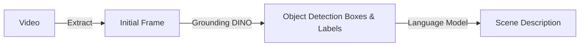

# RoboCoin Scene Annotator

[English](README.md) | [中文](README_CN.md)

RoboCoin Scene Annotator, an automated robot scene annotation generation tool based on open-vocabulary object detectors and large language models.

## Tool Overview

RoboCoin Scene Annotator adopts an integrated detection and description pipeline:


Core Features:
- Open-vocabulary detection capability, no predefined categories required
- Flexible language model integration, supporting local and API modes
- Automated scene description generation
- Visualized annotation results

## Installation Guide

Prerequisites:
- GPU: At least 12GB VRAM (recommended for large models)
- Network: Access to HuggingFace for downloading pre-trained models

Installation Steps

1. Download repository
   ```bash
   git clone --recursive https://github.com/Koorye/RoboCoin-scene-annotator.git
   ```

2. Install Grounding DINO

   Refer to [Grounding DINO official repository](Link2):

   Install PyTorch (recommended torch 2.5.1)
   ```bash
   pip install torch==2.5.1 torchvision==0.20.1 torchaudio==2.5.1 --index-url Link3
   ```

   Install Grounding DINO repository
   ```bash
   cd third_party/GroundingDINO
   pip install -e .
   cd ..
   ```

   Download pre-trained weights
   ```bash
   mkdir weights
   cd weights
   wget -q Link2/releases/download/v0.1.0-alpha/groundingdino_swint_ogc.pth
   cd ..
   ```

3. Install Ollama (optional, for running language models locally)

   Refer to [Ollama official repository](Link4)

   Linux standard installation (root ):
   ```bash
   curl -fsSL https://ollama.com/install.sh | sh
   ```

   Linux manual installation:
   ```bash
   curl -L https://ollama.com/download/ollama-linux-amd64.tgz -o ollama-linux-amd64.tgz
   mkdir -p ~/.local
   tar -C ~/.local -xzf ollama-linux-amd64.tgz
   export PATH="$HOME/.local:$PATH"
   source ~/.bashrc
   ollama serve
   ```

4. Install other dependencies
    ```bash
    pip install -r requirements.txt
    ```

## Usage

Run main program:
```bash
python scripts/run_pipeline.py [parameters]
```

Parameter Details

Parameter Category | Parameter Name | Type | Description
--- | --- | --- | ---
Basic Parameters | --repo_id | str | Repository identifier 
| | --repo_root | str | Repository root path
| | --save_root | str | Results save root path
| | --camera | str | Camera key name
Detector Configuration | --detector.type | str | Detector type 
||--detector.visualize_first | int | Number of frames to visualize, detection results of first few frames will be drawn for manual inspection 
||--detector.model_config_path | str | Model configuration file path
||--detector.model_checkpoint | str | Model weights path 
||--detector.device | str | Running device 
||--detector.box_threshold | float | Detection box threshold 
||--detector.text_threshold | float | Text threshold 
Language Model Configuration | --language_model.type | str | Language model type
| | --language_model.think | bool | Whether to use thinking mode 
| | --language_model.api_url | str | API endpoint URL, API mode only
| | --language_model.api_key | str | API key, API mode only
| | --language_model.model | str | Model name 

Usage Example:
```bash
python scripts/run_pipeline.py \
    --repo_id example_repo \
    --repo_root /path/to/repo_root \
    --save_root results/ \
    --camera observation.front \
    --detector.type grounding_dino \
    --detector.model_config_path configs/grounding_dino/GroundingDINO_SwinT_OGC.py \
    --detector.model_checkpoint weights/groundingdino_swint_ogc.pth \
    --detector.device cuda:0 \
    --detector.box_threshold 0.3 \
    --detector.text_threshold 0.3 \
    --language_model.type ollama \
    --language_model.model deepseek-r1:13b \
    --language_model.think False
```

## Acknowledgments

Thanks to the support of the following excellent projects:
- https://github.com/IDEA-Research/GroundingDINO: Advanced open-vocabulary object detector
- https://github.com/ollama/ollama: Local large language model deployment framework
- Other open-source projects contributing to the computer vision and artificial intelligence fields