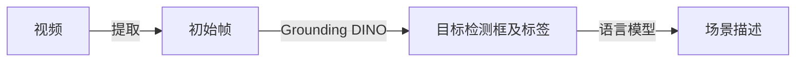

# RoboCoin Scene Annotator

[English](README.md) | [中文](README_CN.md)

RoboCoin Scene Annotator，一个基于开放词汇目标检测器和大语言模型的机器人场景标注自动化生成工具。

## 工具概述

RoboCoin Scene Annotator 采用一体化检测与描述流程：


核心特性：
- 开放词汇检测能力，无需预定义类别
- 灵活的语言模型集成，支持本地和API模式
- 自动化场景描述生成
- 可视化标注结果

## 安装指南

前提要求：
- GPU：至少12GB显存（推荐用于大型模型）
- 网络：可访问HuggingFace以下载预训练模型

安装步骤

1. 下载仓库
   ```bash
   git clone --recursive https://github.com/Koorye/RoboCoin-scene-annotator.git
   ```

2. 安装Grounding DINO

   参考[Grounding DINO官方仓库](https://github.com/IDEA-Research/GroundingDINO)：
   
   安装PyTorch（建议使用torch 2.5.1）
   ```
   pip install torch==2.5.1 torchvision==0.20.1 torchaudio==2.5.1 --index-url https://download.pytorch.org/whl/cu124
   ```
   
   安装Grounding DINO仓库
    ```bash
   cd third_party/GroundingDINO
   pip install -e .
   cd ..
   ```
   
   下载预训练权重
   ```bash
   mkdir weights
   cd weights
   wget -q https://github.com/IDEA-Research/GroundingDINO/releases/download/v0.1.0-alpha/groundingdino_swint_ogc.pth
   cd ..
   ```
   
3. 安装Ollama（可选，用于本地运行语言模型）
   
   参考[Ollama官方仓库](https://github.com/ollama/ollama)
   
   Linux标准安装（需要root）：
   ```bash
   curl -fsSL https://ollama.com/install.sh | sh
   ```
   
   Linux手动安装：
   ```bash
   curl -L https://ollama.com/download/ollama-linux-amd64.tgz -o ollama-linux-amd64.tgz
   mkdir -p ~/.local
   tar -C ~/.local -xzf ollama-linux-amd64.tgz
   export PATH="$HOME/.local:$PATH"
   source ~/.bashrc
   ollama serve
   ```

4. 安装其他依赖
   ```bash
   pip install -r requirements.txt
   ```
   

## 使用方法

运行主程序：
```
python scripts/run_pipeline.py [参数选项]
```

参数详解

参数类别 | 参数名称 | 类型 | 描述
--- | --- | --- | ---
基本参数 | --repo_id | str | 仓库标识符 
| | --repo_root | str | 仓库根路径
| | --save_root | str | 保存结果根路径
| | --camera | str | 相机键名
检测器配置 | --detector.type | str | 检测器类型 
||--detector.visualize_first | int | 可视化帧数量，前几帧检测结果将绘制以供人工检查 
||--detector.model_config_path | str | 模型配置文件路径
||--detector.model_checkpoint | str | 模型权重路径 
||--detector.device | str | 运行设备 
||--detector.box_threshold | float | 检测框阈值 
||--detector.text_threshold | float | 文本阈值 
语言模型配置 | --language_model.type | str | 语言模型类型
| | --language_model.think | bool | 是否使用思考模式 
| | --language_model.api_url | str | API接口地址，仅限API模式
| | --language_model.api_key | str | API密钥，仅限API模式
| | --language_model.model | str | 模型名称 

使用示例：

```bash
python scripts/run_pipeline.py \
    --repo_id example_repo \
    --repo_root /path/to/repo_root \
    --save_root results/ \
    --camera observation.front \
    --detector.type grounding_dino \
    --detector.model_config_path configs/grounding_dino/GroundingDINO_SwinT_OGC.py \
    --detector.model_checkpoint weights/groundingdino_swint_ogc.pth \
    --detector.device cuda:0 \
    --detector.box_threshold 0.3 \
    --detector.text_threshold 0.3 \
    --language_model.type ollama \
    --language_model.model deepseek-r1:13b \
    --language_model.think False
```

## 致谢

感谢以下优秀项目的支持：
- https://github.com/IDEA-Research/GroundingDINO：先进的开放词汇目标检测器
- https://github.com/ollama/ollama：本地大语言模型部署框架
- 其他为计算机视觉和人工智能领域做出贡献的开源项目