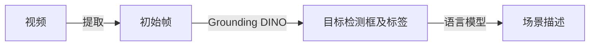

# RoboCoin Scene Annotator

[English](README.md) | [中文](README_zh-CN.md)

RoboCoin Scene Annotator，一个基于开放词汇目标检测器和大语言模型的机器人场景标注自动化生成工具。

## 工具概述

RoboCoin Scene Annotator 采用一体化检测与描述流程：


核心特性：
- 开放词汇检测能力，无需预定义类别
- 灵活的语言模型集成，支持本地和API模式
- 自动化场景描述生成
- 可视化标注结果

## 安装指南

前提要求：
- GPU：建议至少12GB显存
- 网络：可访问HuggingFace以下载预训练模型

安装步骤

1. 下载仓库
   ```bash
   git clone --recursive https://github.com/Koorye/RoboCoin-scene-annotator.git
   ```

2. 安装Grounding DINO

   参考[Grounding DINO官方仓库](https://github.com/IDEA-Research/GroundingDINO)：
   
   安装PyTorch（建议使用torch 2.5.1）
   ```
   pip install torch==2.5.1 torchvision==0.20.1 torchaudio==2.5.1 --index-url https://download.pytorch.org/whl/cu124
   ```
   
   安装Grounding DINO仓库
    ```bash
   cd third_party/GroundingDINO
   pip install -e .
   cd ..
   ```
   
   下载预训练权重
   ```bash
   mkdir weights
   cd weights
   wget -q https://github.com/IDEA-Research/GroundingDINO/releases/download/v0.1.0-alpha/groundingdino_swint_ogc.pth
   cd ..
   ```
   
3. 安装Ollama（可选，用于本地运行语言模型）
   
   参考[Ollama官方仓库](https://github.com/ollama/ollama)
   
   Linux标准安装（需要root）：
   ```bash
   curl -fsSL https://ollama.com/install.sh | sh
   ```
   
   Linux手动安装：
   ```bash
   curl -L https://ollama.com/download/ollama-linux-amd64.tgz -o ollama-linux-amd64.tgz
   mkdir -p ~/.local
   tar -C ~/.local -xzf ollama-linux-amd64.tgz
   export PATH="$HOME/.local:$PATH"
   source ~/.bashrc
   ollama serve
   ```

4. 安装其他依赖
   ```bash
   pip install -r requirements.txt
   ```
   

## 使用方法

运行主程序：
```
python scripts/run_pipeline.py [参数选项]
```

参数详解

参数类别 | 参数名称 | 类型 | 描述
--- | --- | --- | ---
基本参数 | --repo_id | str | 仓库标识符 
| | --repo_root | str | 仓库根路径
| | --save_root | str | 保存结果根路径
| | --camera | str | 相机键名
检测器配置 | --detector.type | str | 检测器类型 
||--detector.visualize_first | int | 可视化帧数量，前几帧检测结果将绘制以供人工检查 
||--detector.model_config_path | str | 模型配置文件路径
||--detector.model_checkpoint | str | 模型权重路径 
||--detector.device | str | 运行设备 
||--detector.box_threshold | float | 检测框阈值 
||--detector.text_threshold | float | 文本阈值 
语言模型配置 | --language_model.type | str | 语言模型类型
| | --language_model.think | bool | 是否使用思考模式 
| | --language_model.api_url | str | API接口地址，仅限API模式
| | --language_model.api_key | str | API密钥，仅限API模式
| | --language_model.model | str | 模型名称 

使用示例：

```bash
python scripts/run_pipeline.py \
    --repo_id example_repo \
    --repo_root /path/to/repo_root \
    --save_root results/ \
    --camera observation.front \
    --detector.type grounding_dino \
    --detector.model_config_path configs/grounding_dino/GroundingDINO_SwinT_OGC.py \
    --detector.model_checkpoint weights/groundingdino_swint_ogc.pth \
    --detector.device cuda:0 \
    --detector.box_threshold 0.3 \
    --detector.text_threshold 0.3 \
    --language_model.type ollama \
    --language_model.model deepseek-r1:13b \
    --language_model.think False
```

### 详细流程

该程序将启动场景标注流程，处理指定仓库的视频数据，并将生成的标注结果保存到指定路径。

1. Prompt提取：从任务描述中提取物体列表，生成检测提示词，结果保存在`<save_root>/prompts/<repo_id>.txt`文件中。
   示例：`results/prompts/unitree_g1_food_storage.txt`
   ```
   basket . white bowl . cake . donut . white plate .
   ```

2. 初始帧提取：从视频中提取初始帧，并可视化检测结果以供检查，结果将保存在`<save_root>/frames/<repo_id>/`目录下。
   示例输出：
   

3. 目标检测：使用Grounding DINO进行目标检测，结果将保存在`<save_root>/annotations/<repo_id>/`目录下。
   示例：`results/annotations/unitree_g1_food_storage/episode_000000.json`
   ```json
      {
     "object": [
       {
         "name": "basket",
         "box": {
           "x_center": 0.5401855111122131,
           "y_center": 0.43615126609802246,
           "width": 0.47688308358192444,
           "height": 0.3583659827709198
         },
         "logit": 0.7744243144989014,
         "info": {
           "position": "center"
         }
       },
       {
         "name": "white bowl white plate",
         "box": {
           "x_center": 0.21382831037044525,
           "y_center": 0.7187483310699463,
           "width": 0.38848257064819336,
           "height": 0.41331198811531067
         },
         "logit": 0.41868603229522705,
         "info": {
           "position": "back left"
         }
       },
       {
         "name": "donut",
         "box": {
           "x_center": 0.19377967715263367,
           "y_center": 0.7328643202781677,
           "width": 0.2978207468986511,
           "height": 0.3233490288257599
         },
         "logit": 0.38621386885643005,
         "info": {
           "position": "back left"
         }
       },
       {
         "name": "white plate",
         "box": {
           "x_center": 0.8474635481834412,
           "y_center": 0.8461897373199463,
           "width": 0.3014012575149536,
           "height": 0.30122512578964233
         },
         "logit": 0.30470189452171326,
         "info": {
           "position": "back right"
         }
       },
       {
         "name": "donut",
         "box": {
           "x_center": 0.2593638002872467,
           "y_center": 0.6321070790290833,
           "width": 0.16489802300930023,
           "height": 0.12321418523788452
         },
         "logit": 0.33250319957733154,
         "info": {
           "position": "back left"
         }
       }
     ]
   }
   ```

4. 生成场景描述：基于检测结果生成场景描述，结果将保存在`<save_root>/annotations_refined/<repo_id>/`目录下。
   示例：`results/annotations_refined/unitree_g1_food_storage/episode_000000.json`
   ```json
   {
     "object": [
       {
         "name": "basket",
         "box": {
           "x_center": 0.5401855111122131,
           "y_center": 0.43615126609802246,
           "width": 0.47688308358192444,
           "height": 0.3583659827709198
         },
         "logit": 0.7744243144989014,
         "info": {
           "position": "center"
         }
       },
       {
         "name": "white bowl white plate",
         "box": {
           "x_center": 0.21382831037044525,
           "y_center": 0.7187483310699463,
           "width": 0.38848257064819336,
           "height": 0.41331198811531067
         },
         "logit": 0.41868603229522705,
         "info": {
           "position": "back left"
         }
       },
       {
         "name": "donut",
         "box": {
           "x_center": 0.19377967715263367,
           "y_center": 0.7328643202781677,
           "width": 0.2978207468986511,
           "height": 0.3233490288257599
         },
         "logit": 0.38621386885643005,
         "info": {
           "position": "back left"
         }
       },
       {
         "name": "white plate",
         "box": {
           "x_center": 0.8474635481834412,
           "y_center": 0.8461897373199463,
           "width": 0.3014012575149536,
           "height": 0.30122512578964233
         },
         "logit": 0.30470189452171326,
         "info": {
           "position": "back right"
         }
       },
       {
         "name": "donut",
         "box": {
           "x_center": 0.2593638002872467,
           "y_center": 0.6321070790290833,
           "width": 0.16489802300930023,
           "height": 0.12321418523788452
         },
         "logit": 0.33250319957733154,
         "info": {
           "position": "back left"
         }
       }
     ],
     "description": "The basket is at the center. The white bowl and white plate (back left) contain the donut located there."
   }
   ```

## 致谢

感谢以下优秀项目的支持：
- [Grounding DINO](https://github.com/IDEA-Research/GroundingDINO)：开放词汇目标检测器
- [Ollama](https://github.com/ollama/ollama)：本地大语言模型部署框架
- 其他为计算机视觉和人工智能做出贡献的开源项目